# Práctica 2 - Ejercicios 1.2

Capacidades y mecanismos de ejecución de código de los navegadores Web.

## Ejercicio 1

Añade un segundo botón al ejemplo de los apuntes que, además de cambiar el párrafo, cambie también el texto del `<h1>` con `getElementById()` e `innerHTML`. El primer botón se mantiene tal cual.

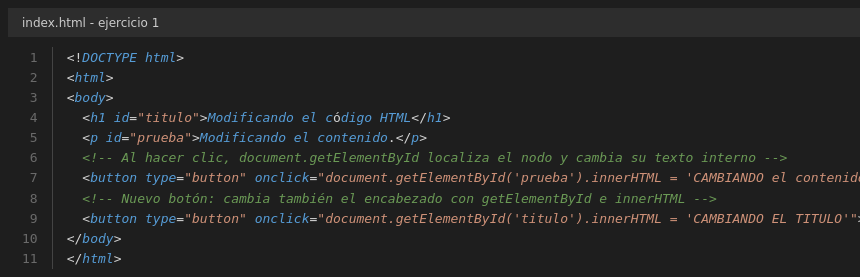

Al pulsar el botón del título, el encabezado cambia y el párrafo sigue como estaba:

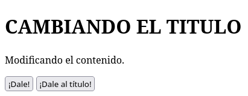

## Ejercicio 2

Página que captura el evento clic de un botón y emite una traza informativa por `console.log()` en las herramientas de desarrollo.

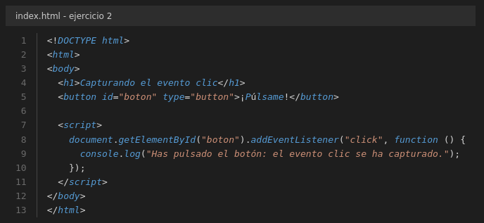

Salida por consola al pulsar el botón:

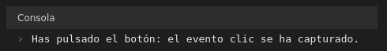

## Ejercicio 3

Modifica el ejercicio anterior sustituyendo la escritura en el párrafo por un cuadro de aviso emergente con `alert()`. El botón que escribía en el párrafo se deja como estaba.

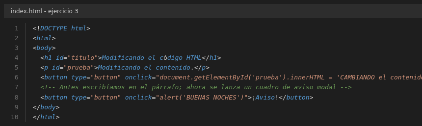

Salida por consola:

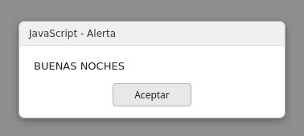

## Ejercicio 4

Web con tres botones (Ruso, Español, Inglés) que cambian el texto de un `
` y le aplican un color de fuente distinto con `.style.color`.

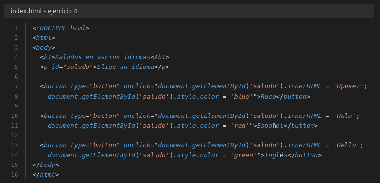

Salida por consola tras pulsar «Ruso»:

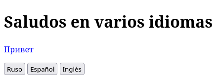

## Ejercicio 5

Adapta el ejercicio anterior para que los saludos se impriman únicamente por consola, sin escribir en el párrafo.

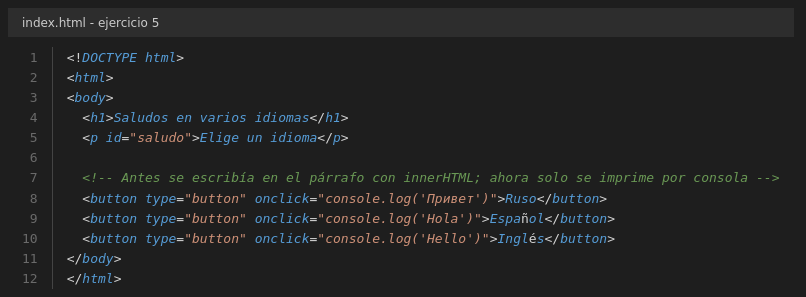

Salida por consola:

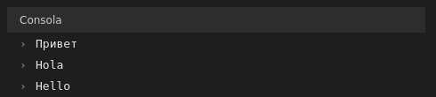

## Ejercicio 6

Transforma el código para generar los textos directamente en el flujo de la página con `document.write()`.

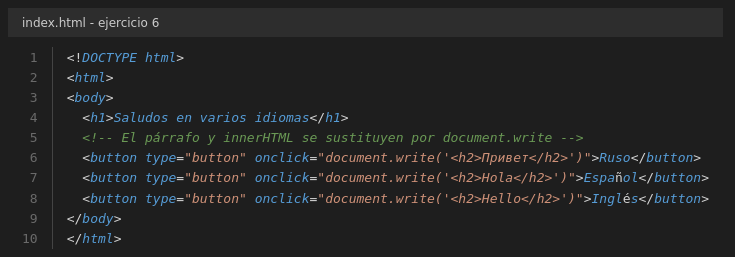

Salida por consola tras pulsar «Español»:

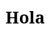

Como advierte la teoría, `document.write()` ejecutado **después** de la carga borra el documento entero y deja solo lo escrito en esa llamada: por eso en la captura únicamente aparece el saludo y han desaparecido el título y los botones.

## Ejercicio 7

Interfaz con un `<h1>`, un `
Sistema en espera
` y tres botones: **Consola** (traza con la hora del sistema), **Estilo** (fondo verde y texto «Sistema Activo») y **Alerta** (aviso modal de proceso concluido).

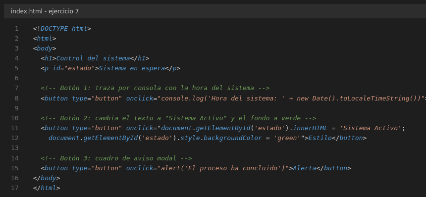

Salida por consola del botón 1:

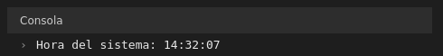

Salida por consola del botón 2:

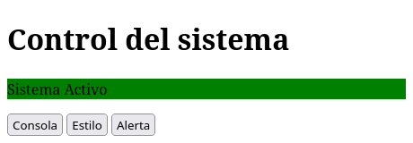

Salida por consola del botón 3:

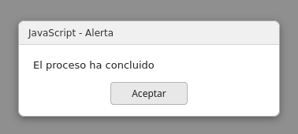

## Ejercicio 8

Test interactivo de siete preguntas con botones «Verdadero» y «Falso». Al hacer clic, el script evalúa el acierto y modifica `.style.color` a `green` si acierta o a `red` si falla.

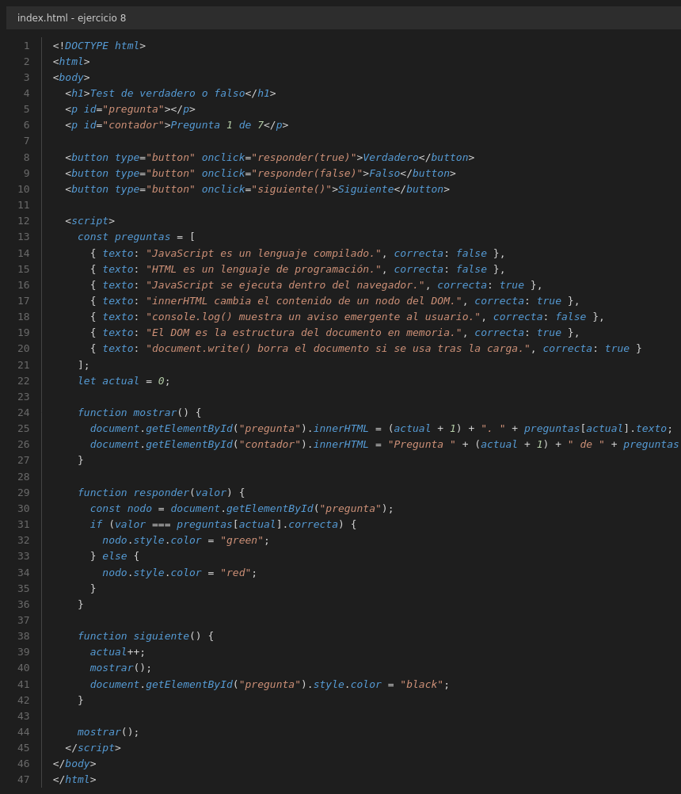

Acierto (se responde «Falso» a la primera pregunta):

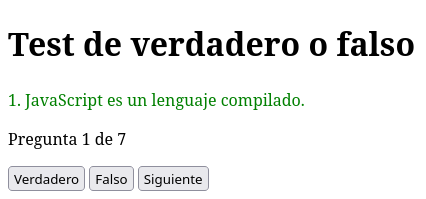

Fallo (se responde «Verdadero» a la misma pregunta):

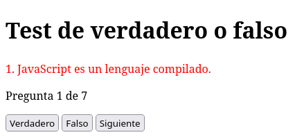

## Ejercicio 9

Secuencia cíclica de cuatro imágenes fotograma a fotograma. Al hacer clic sobre la imagen, el script comprueba cuál se está visualizando y reasigna el atributo `.src` con la siguiente, volviendo a la primera al llegar al final.

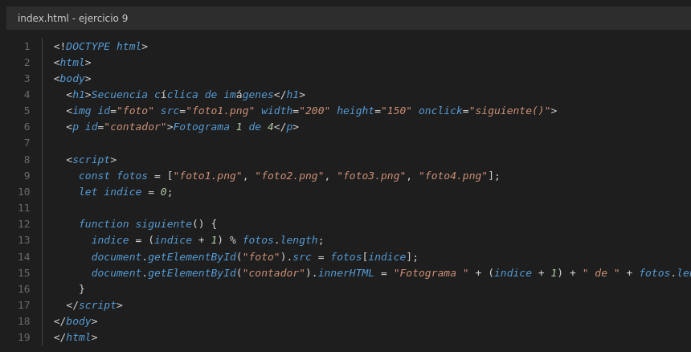

Las cuatro imágenes de la secuencia son `foto1.png`, `foto2.png`, `foto3.png` y `foto4.png`.

Salida por consola tras dos clics:

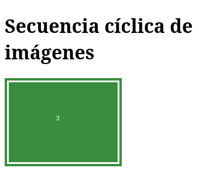