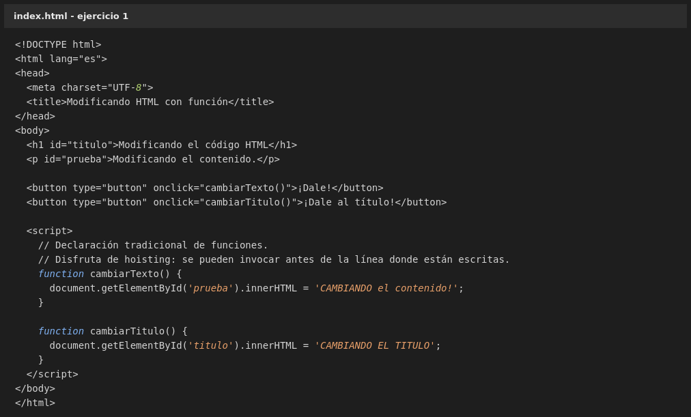
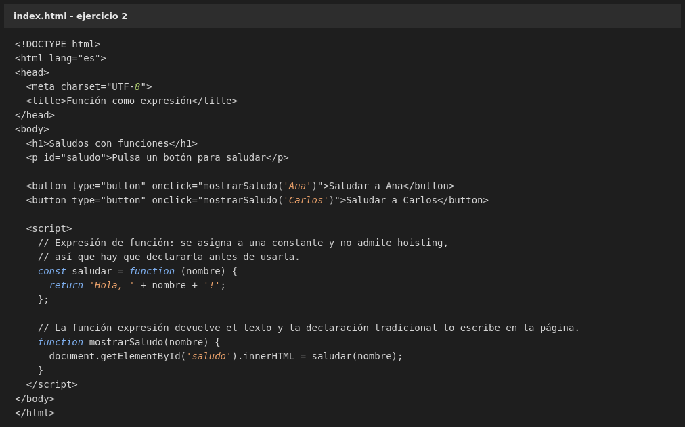
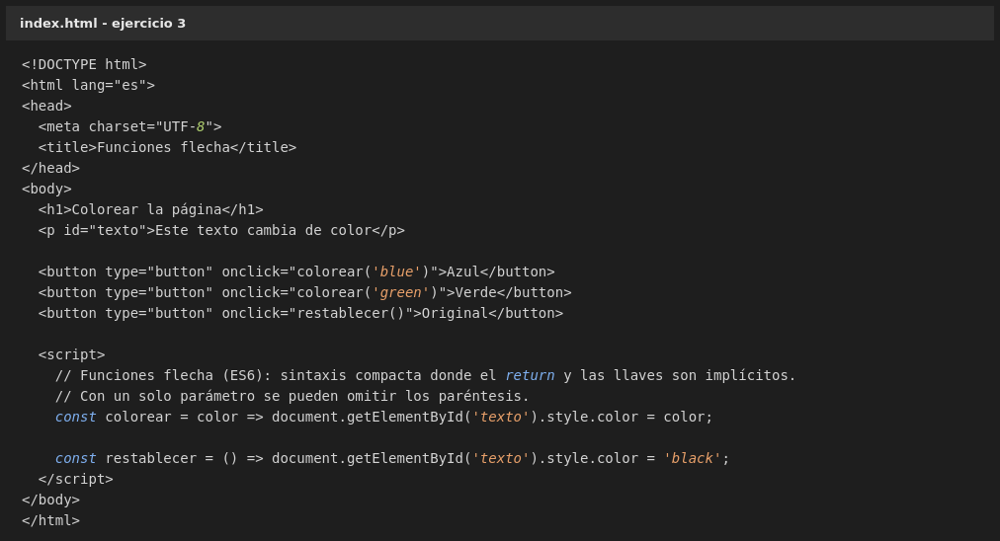
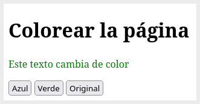

# Práctica 3 - Ejercicios 1.3

Identificación y caracterización de los principales lenguajes relacionados con la programación de clientes Web.

## Actividad 1 - Los ejercicios del apartado anterior haciendo uso de funciones

El apartado anterior (F) explica las tres formas principales de declarar funciones en JavaScript. El ejercicio consiste en repetir el ejemplo de los apuntes, *Modificar el Contenido de la Página Web*, pero escribiendo el código con funciones en lugar de instrucciones sueltas. Se hace un ejercicio por cada forma de declaración.

### Ejercicio 1 - Declaración tradicional

El ejemplo de los apuntes, con una segunda función para cambiar también el encabezado. Una función declarada así disfruta de *hoisting*: se puede invocar antes de la línea donde está escrita.

Al pulsar los dos botones cambian el título y el párrafo:

### Ejercicio 2 - Expresión de función

La función se asigna a una constante con `const` y, a diferencia de la declaración tradicional, no admite *hoisting*, por lo que hay que declararla antes de usarla. La función devuelve el saludo y otra función lo escribe en la página.

Al pulsar *Saludar a Carlos* se muestra el texto devuelto por la función:

### Ejercicio 3 - Funciones flecha

Sintaxis moderna y compacta de ES6. Si el cuerpo tiene una sola línea, el `return` y las llaves `{}` son implícitos, y con un solo parámetro se pueden omitir los paréntesis.

Al pulsar *Verde* el texto de la página cambia de color:

## Actividad 2 - Actividad Propuesta 1.1: ¿Qué es la programación reactiva?

Los apuntes definen el **patrón reactivo** como un modelo de programación basado en flujos de datos asíncronos que reacciona de forma automática, propagando los cambios en la interfaz cuando el estado de los datos varía.

La diferencia con la programación imperativa está en quién hace el trabajo. En la forma imperativa el programador dice *exactamente* qué hay que cambiar en cada paso (*cambia este texto, luego hides este panel*). En la forma reactiva el programador declara únicamente **la relación** entre los datos y deja que sea el sistema quien se encargue de mantenerlos coherentes cuando algo cambie.

### El ejemplo de la hoja de cálculo

Una hoja de cálculo funciona exactamente así. Una celda no guarda un resultado escrito a mano, sino una **fórmula que depende de otras celdas**. Al modificar una celda, el motor de recálculo detecta qué celdas la usan como dependencia y las vuelve a calcular, y después hace lo mismo con las celdas que dependen de esas, en cascada, hasta que ya no queda nada afectado.

Por ejemplo, con esta hoja:

| Celda | Contenido | Depende de |
| --- | --- | --- |
| A1 | 10 | — |
| B1 | `=A1*2` | A1 |
| C1 | `=B1+5` | B1 |
| D1 | `=B1*10` | B1 |

Si en A1 se cambia el 10 por un 5, no hace falta tocar nada más: la hoja recalcula B1, que pasa a ser 10, y a partir de ahí vuelve a calcular C1 y D1, que pasan a ser 15 y 100. El usuario solo ha editado una celda y el resto se ha actualizado por dependencia. Ese comportamiento de recálculo inmediato en cascada es la idea central de la programación reactiva.

La diferencia con el ejemplo de esta práctica es que aquí la hoja de cálculo **contiene** la fórmula, así que el propio programa sabe de antemano qué depende de qué. En una aplicación web el navegador no puede saberlo por sí solo, y por eso los frameworks añaden la parte que falta: guardan el estado de los datos y se encargan de propagar los cambios hasta la interfaz. ReactJS, por ejemplo, mantiene en la memoria RAM una copia ligera del DOM y, cuando los datos cambian, calcula las diferencias mínimas entre esa copia y el DOM real para actualizar únicamente los nodos necesarios.

## Actividad 3 - Tabla comparativa de frameworks

| Escenario | Framework elegido | Justificación |
| --- | --- | --- |
| 1. Pequeña tienda de barrio, presupuesto reducido y despliegue rápido | **Vue.js** | Es el más ligero y el que prioriza la ligereza y la velocidad de ejecución, y su curva de aprendizaje es progresiva: resulta mucho más accesible y suave que la de Angular, así que un equipo pequeño puede ponerlo en marcha sin curva previa. No hay coste de licencia ni de aprendizaje elevado, y con su DOM virtual el rendimiento es más que suficiente para el catálogo de una tienda. Suele además combinarse con frameworks de back-end como Laravel para estructurar interfaces interactivas. |
| 2. Portal bancario de una entidad financiera, cientos de programadores y tipado robusto estricto | **Angular** | Se programa en TypeScript, un superconjunto tipado de JavaScript mantenido por Microsoft que añade interfaces y tipado estático, justo lo que exige un sector con requisitos tan estrictos: los errores se detectan al compilar y no en producción. Su rigidez estructural no es un defecto aquí, sino una ventaja, porque estandariza la arquitectura (inyección de dependencias, módulos, componentes) y permite que cientos de programadores se incorporen al proyecto trabajando todos igual. Además, Angular exige dominar programación reactiva con RxJS, que encaja con un portal con muchos eventos simultáneos. |
| 3. Aplicación interactiva con renderizado ultra rápido de miles de productos y cambios constantes en pantalla | **ReactJS** | Es el que mejor responde a ese requisito. Manipular el DOM nativo obliga al motor a recalcular geometrías y repintar píxeles, así que con miles de productos y cambios constantes el rendimiento se hundiría. ReactJS mantiene en la memoria RAM una copia ligera del DOM (DOM Virtual) y, cuando los datos cambian, calcula las diferencias mínimas entre el DOM virtual y el real (reconciliación) para actualizar únicamente los nodos estrictamente necesarios. Además, su programación orientada a componentes hace que cada componente gestione su propio estado, de modo que un cambio en una tarjeta de producto no obliga a repintar el catálogo entero. Es, además, el más ampliamente adoptado del mercado. |

**Conclusión:** los tres casos esperan perfiles distintos. Vue.js gana donde prima la rapidez de puesta en marcha y el coste cero; Angular, donde prima la orden y la robustez del tipado en proyectos grandes con muchos programadores; y ReactJS, donde prima el rendimiento del renderizado ante cambios constantes en el DOM.