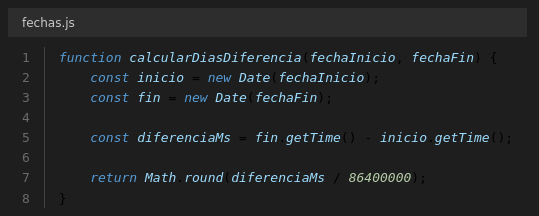
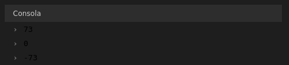
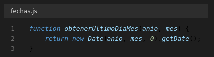
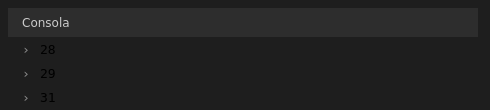
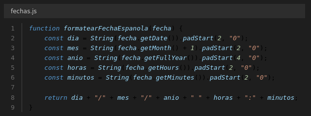
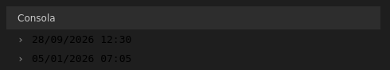
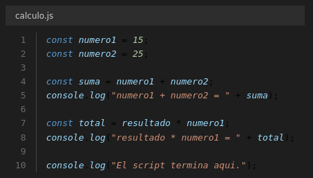
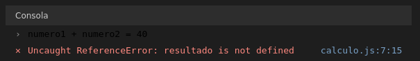

# Práctica 4 - Ejercicios 1.4

## Ejercicio 1

Analiza el siguiente código sin ejecutarlo y predice qué fecha representa cada variable.

| Variable | Fecha que representa |
|---|---|
| `fechaA` | 10 de enero de 2026 |
| `fechaB` | 1 de enero de 2027 |
| `fechaC` | 1 de enero de 1970 00:00:02.026 |
| `fechaD` | 28 de febrero de 2026 |
| `fechaE` | 28 de febrero de 2026 (formato no estándar, depende del motor) |

## Ejercicio 2

Función `calcularDiasDiferencia(fechaInicio, fechaFin)` que recibe dos cadenas de texto en formato `YYYY-MM-DD` y devuelve el número entero de días transcurridos entre ambas, usando la diferencia en milisegundos con `getTime()` y redondeando con `Math.round()`.

Salida por consola:

## Ejercicio 3

Función `obtenerUltimoDiaMes(anio, mes)` que devuelve los días que tiene el mes indicado, pasándole el mes en formato humano (1 = enero, 2 = febrero...) y aprovechando el desbordamiento del día 0.

Salida por consola:

## Ejercicio 4

Función `formatearFechaEspanola(fecha)` que recibe un objeto `Date` y devuelve la fecha con el formato exacto `DD/MM/YYYY HH:mm`, rellenando con ceros a la izquierda mediante `padStart(2, "0")`.

Salida por consola:

## Ejercicio 5

| | Java | JavaScript |
|---|---|---|
| Tipo | Lenguaje tradicional, compilado | Lenguaje de script, interpretado |
| Ejecución | Bytecode sobre la máquina virtual (JVM) | El motor del navegador lo interpreta línea a línea |
| Tipado | Fuertemente tipado | Débilmente tipado |
| Detección de errores | En tiempo de compilación | En tiempo de ejecución |
| Orientación | Orientado a objetos | Orientado a eventos |
| Base de datos | Acceso directo (JDBC) | Sin acceso directo, usa el DOM o un servidor |

## Ejercicio 6

- Es la única tecnología que ejecuta lógica en el navegador.
- No necesita compilación ni instalar nada: se abre la página y listo.
- Portabilidad total: el mismo código funciona en el navegador de cualquier ordenador, tableta o móvil.
- Agilidad: se guarda, se recarga la página y se ve el resultado.
- Permite modificar la página y pedir datos al servidor sin recargarla.
- Ecosistema maduro y gratuito (React, Vue, Angular, npm, TypeScript).
- También se ejecuta fuera del navegador: en consola con Node.js y como app con Electron.

## Ejercicio 7

Script `calculo.js` que intenta hacer una operación matemática con la variable `resultado`, que no ha sido declarada previamente.

Salida por consola:

El intérprete ejecuta las líneas 1 a 5 con normalidad, se detiene en la línea 7 con el `ReferenceError` y la línea 10 nunca llega a mostrarse.
