# Práctica 5 - Ejercicios 1.5

Verificación de los mecanismos de integración de los lenguajes de marcas con los lenguajes de programación de clientes Web.

## Actividad 1 - Código en ficheros externos separados

Se crean `index.html` y `script.js` en la misma carpeta con el código de ficheros separados del apartado B.

El archivo `index.html` solo se ocupa de la estructura y enlaza el fichero externo:

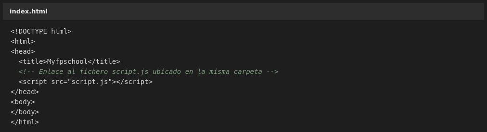

El archivo `script.js` contiene toda la lógica y la ejecuta al cargarse:

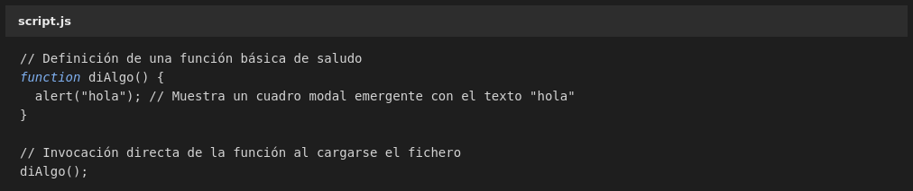

Al abrir la página en el navegador aparece el cuadro de alerta con el texto "hola":

**Comprobación.** Como el enunciado pide verificar que el aviso aparece, se ha comprobado que el fichero externo se carga y se ejecuta de verdad. Para poder capturarlo se sustituyó temporalmente el `alert` nativo por una función que guarda el texto, sin modificar `script.js`:

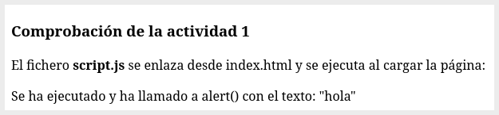

El resultado de esa comprobación confirma que el fichero se descarga, se ejecuta y llama a `alert()` con el texto "hola".

## Actividad 2 - Código JavaScript embebido dentro del HTML

El mismo aviso, pero con el código incrustado en el propio documento. La función se declara en el `head` y se invoca desde un segundo bloque `script` en el `body`:

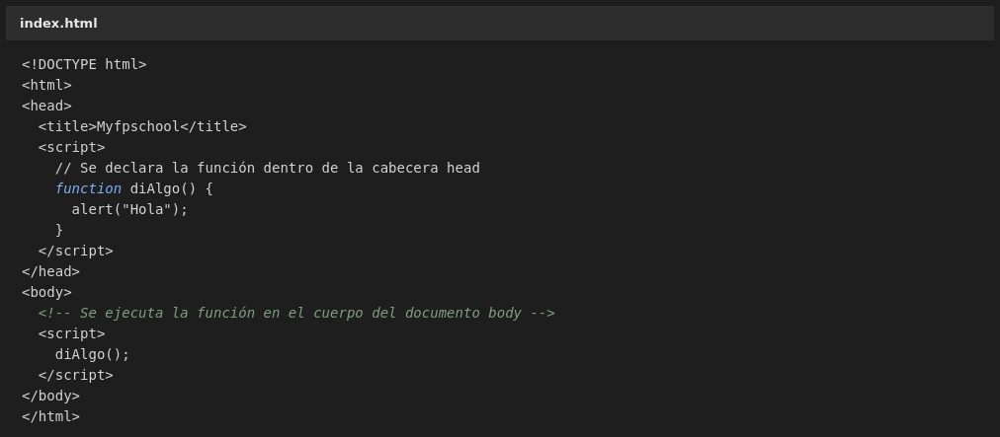

Se repite exactamente el mismo efecto visual ante el usuario, con el cuadro de alerta:

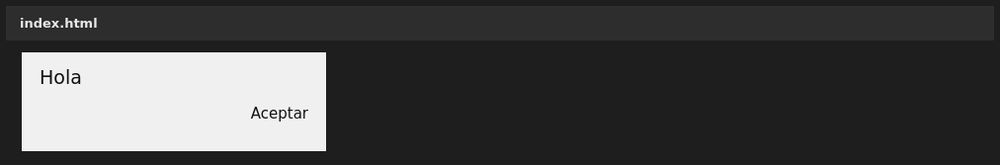

Como se ve, **el resultado es idéntico** al de la actividad 1. La diferencia no está en lo que ve el usuario, sino en el mantenimiento: aquí el código queda disperso entre el `head` y el `body`, mientras que en la actividad 1 toda la lógica vive en un único archivo.

## Práctica de laboratorio guiada - Reorganización del proyecto

### 1. Estructura de carpetas

Se organiza el proyecto separando cada recurso en su propio directorio:

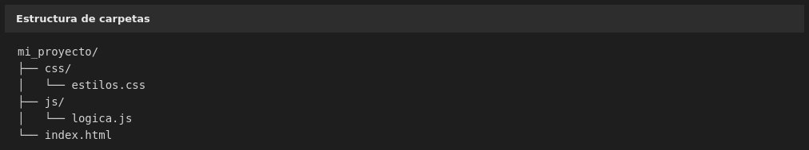

### 2. Traslado del script embebido a `js/logica.js`

El bloque de script que cambiaba el color del botón se traslada a `js/logica.js`:

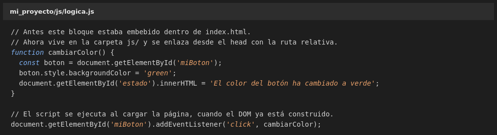

Los estilos se separan también en `css/estilos.css`:

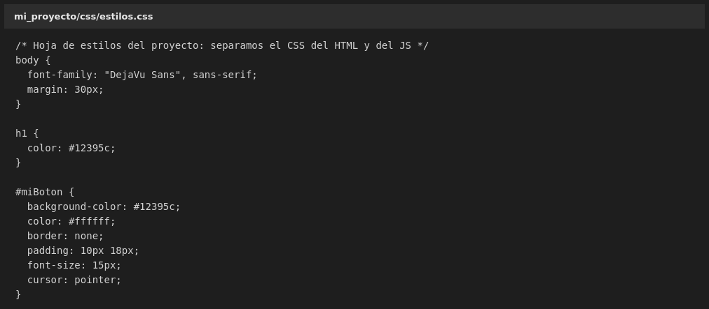

Y `index.html` queda limpio, enlazando cada recurso con su ruta relativa:

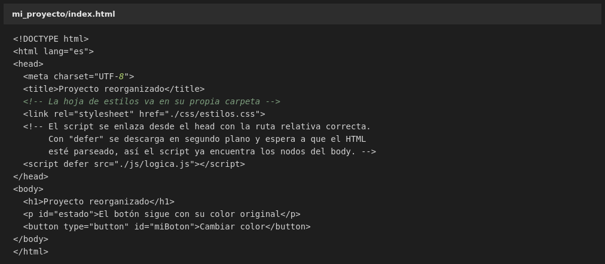

Un detalle importante: el script se enlaza con el atributo `defer`. Sin él, el navegador ejecuta el script del `head` antes de haber construido el `body`, así que `document.getElementById('miBoton')` devolvería `null` y el código fallaría. Con `defer` la ejecución se retrasa hasta que el HTML está parseado por completo, que es justo el problema que describe el apartado D de los apuntes.

Al pulsar el botón, su color cambia a verde:

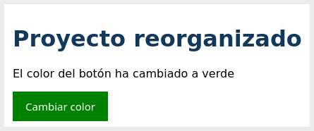

### 3. Comprobación en la pestaña Network

La pestaña Network de las herramientas del desarrollador (F12) muestra que los dos ficheros se sirven correctamente:

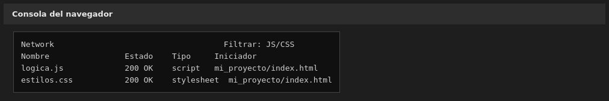

## Ejercicios del 1.2 y 1.4 con la estructura anterior

Para comprobar que la estructura sirve también para el resto de ejercicios, se repiten algunos de los ejercicios de los apartados anteriores usando la misma organización de carpetas.

### Del apartado 1.2

Con el contenido, el encabezado y los saludos en distintos idiomas, resueltos desde `js/logica.js`:

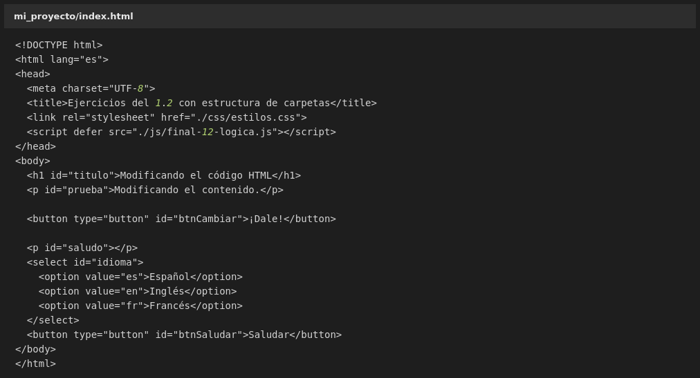

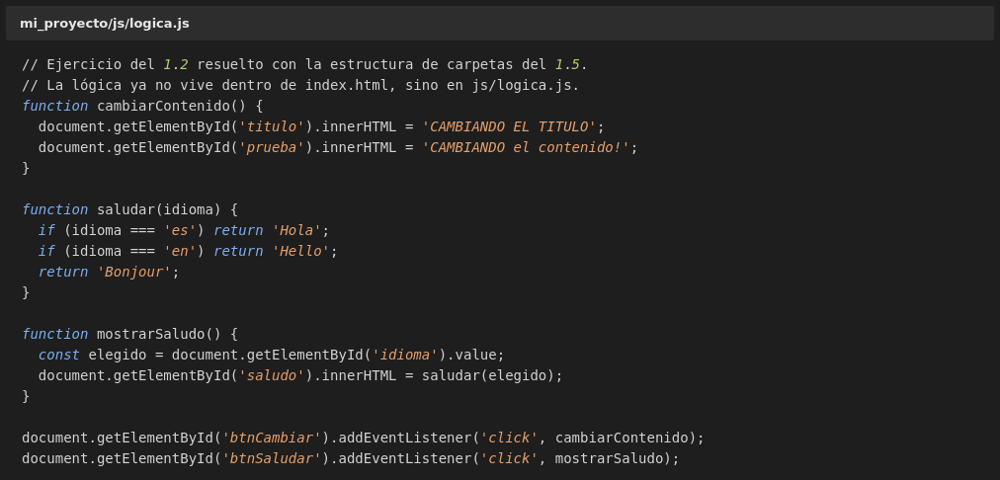

Al pulsar los dos botones cambian el título y el párrafo, y se muestra el saludo del idioma elegido:

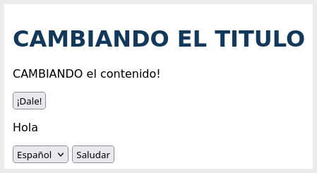

### Del apartado 1.4

Con las funciones de formatear fecha en español y obtener el último día del mes, también en `js/logica.js`:

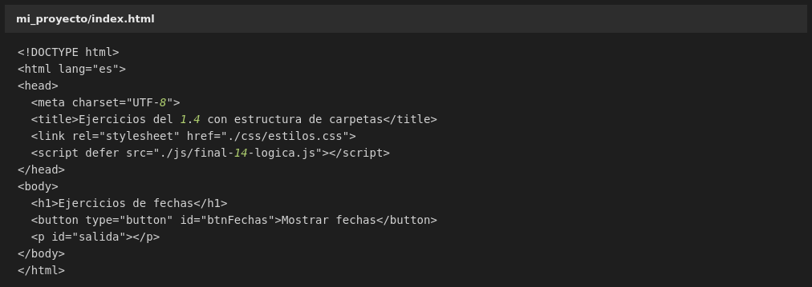

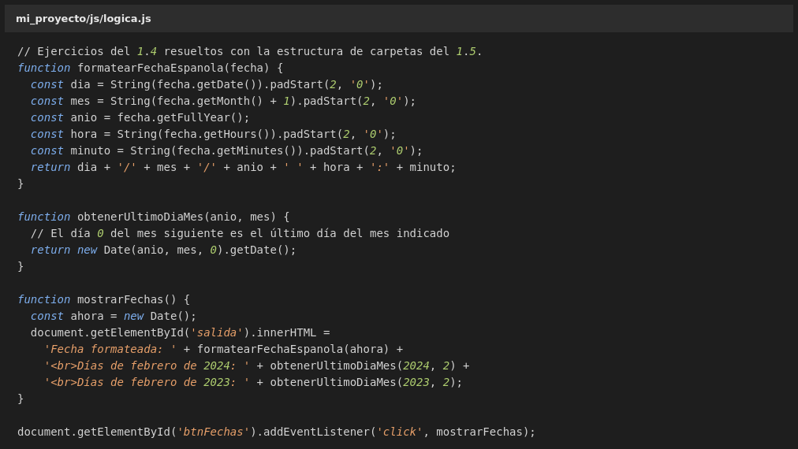

Al pulsar el botón se muestran la fecha formateada y los días de febrero de dos años distintos:

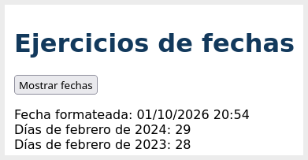